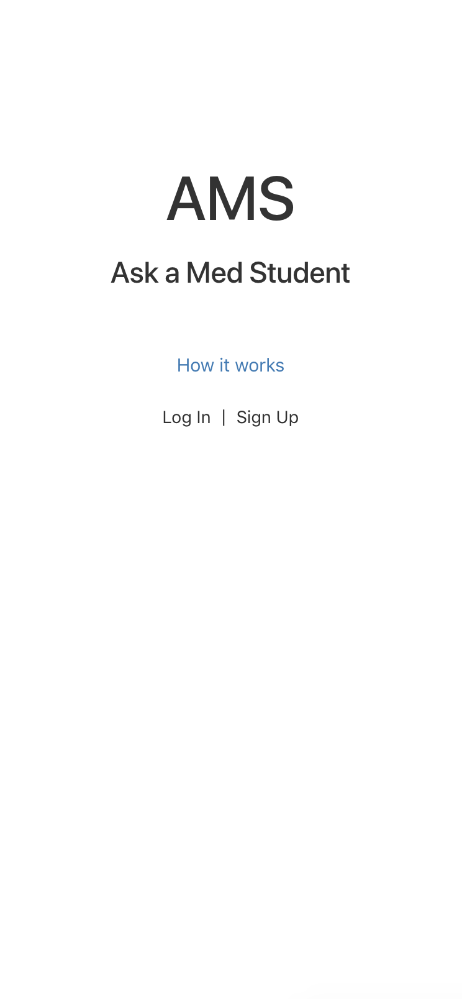
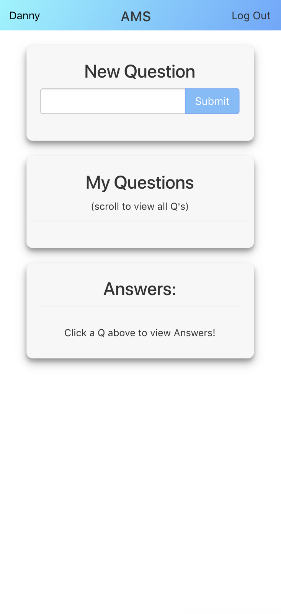
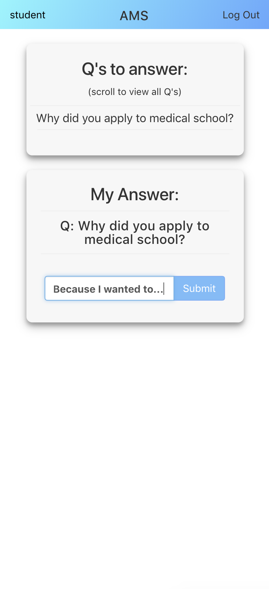
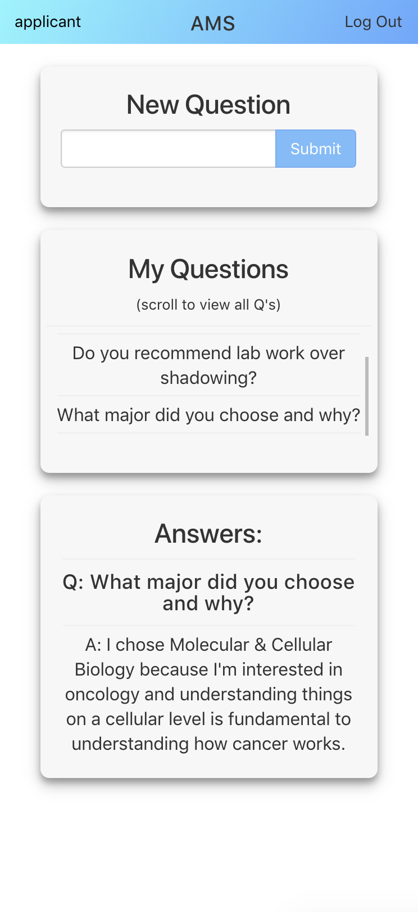

## Ask a Med Student 

## Introduction
- Ask a Med Student: An online platform designed to connect students interested in medical school with current medical students. Users can submit questions and medical students can respond to those questions for the submitters to see.

## Technologies Used 
- HTML5
- CSS
- Javascript
- React
- Express
- Node.js
- Mongoose

## Getting Started

[Trello Board](https://trello.com/b/zdBIle6n/project-4)

[Click to launch!](http://askamedstudent.herokuapp.com)

## Future Enhancemenets
- Add 'edit' & 'delete' functionality for Q's & A's
- Allow 'applicant' users to upvote answers
- Add additional functionality (like 'essay uploading / sharing')
